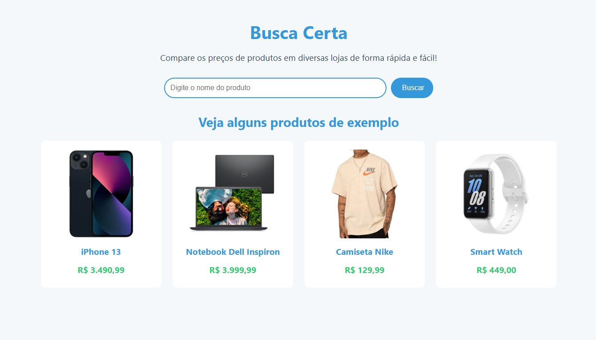

# Busca Certa

Aplicativo para comparar preços de produtos de forma simples e rápida. Pesquise por produtos, veja os preços em diferentes lojas e acesse os detalhes diretamente no Mercado Livre.

🌐 **Demo**: [Veja a aplicação](https://busca-certa.netlify.app/)

## 

## 🛠️ Funcionalidades

- 🔍 **Busca de Produtos**: Encontre os melhores preços e detalhes dos produtos.
- 📊 **Gráfico de Comparação**: Compare os preços em diferentes lojas.
- 🌟 **Produtos de Exemplo**: Veja sugestões de produtos na tela inicial.
- 🖱️ **Acesso Rápido**: Clique no produto ou na imagem para ver mais detalhes no Mercado Livre.
- ↩️ **Voltar à Tela Inicial**: Clique no título para retornar à tela inicial.

---

## 📦 Instalação

````markdown
## Como Rodar a Aplicação Localmente

1. Clone o repositório:

   ```bash
   git clone https://github.com/seu-usuario/busca-certa.git
   cd busca-certa
   ```
````

2. Use o **Live Server** no VS Code ou abra o arquivo `index.html` diretamente no navegador para rodar a aplicação.
